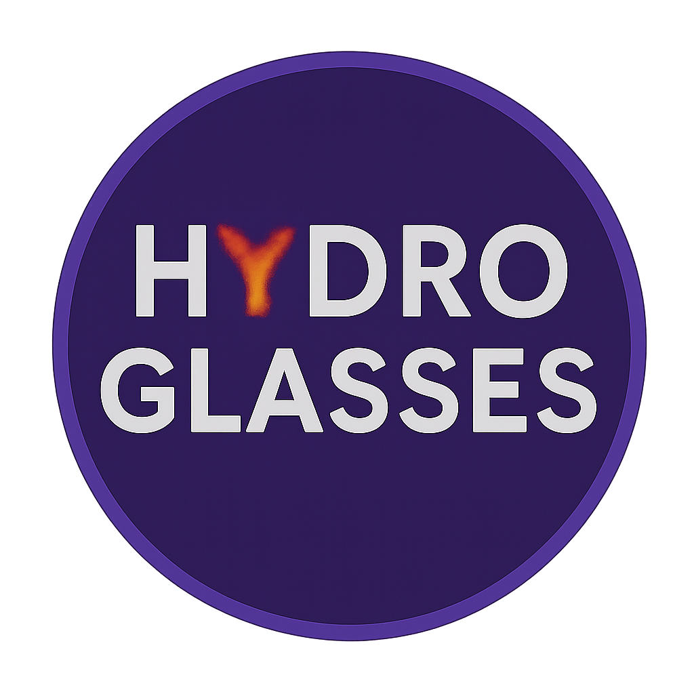

<p align="center">
  
</p>

# vibroglass

A Python toolkit for computing lattice dynamics and hydrodynamic properties of glasses and amorphous materials.

vibroglass provides an efficient, parallelised pipeline for computing vibrational spectra using the **Haydock-Lanczos** algorithm -- without the need for full matrix diagonalisation.

## Features

- **Vibrational Dynamic Structure Factor** S(Q, omega) via the Haydock-Lanczos recursion
- **Stochastic VDOS** with element-resolved projections
- **IR spectra** from Born effective charges
- **Hydrodynamic thermal transport** analysis (disorder widths, heat capacity, kappa)
- **kaldo interoperability** for importing phonon data
- Supports LAMMPS, NumPy, and kaldo input formats

## Installation

```bash
pip install -e .
```

### Dependencies

Core: `numpy`, `scipy`, `opt_einsum`, `ase`, `pandas`

Optional: `kaldo` (phonon interoperability), `matplotlib` (plotting)

## Quick start

### Load a system and compute VDOS

```python
from vibroglass import VibrationalSystem, VibrationalSpectra, LanczosOptions
import numpy as np

# Load dynamical matrix and atoms from a directory containing
# dynmat.npz and replicated_atoms.xyz
system = VibrationalSystem(root="path/to/data")

# Configure the Lanczos computation
options = LanczosOptions(hl_steps=300, eta=1.0)
spectra = VibrationalSpectra(system, options=options)

# Compute stochastic VDOS with 10 random vectors
vdos = spectra.compute_stochastic_vdos(nstoc=10)

# Average spectra
omega = spectra.options.omega_array
mean_spectrum = np.mean([omega * vdos[i]["S"] for i in range(10)], axis=0)
```

### Compute S(Q, omega)

```python
spectrum = spectra.compute_vdsf(nq=8)

# Access longitudinal and transverse components
Q = spectrum["Q"]
omega = spectrum["omega"]
S_L = spectrum[0]["L"]["S"]  # first Q-point, longitudinal
S_T = spectrum[0]["T"]["S"]  # first Q-point, transverse
```

### Compute IR spectrum

```python
ir = spectra.compute_IR_spectrum(
    polarizations=[0, 1, 2],
    charges_dict={"Si": 3.2, "O": -1.6},
)
```

### Load from different formats

```python
from vibroglass import load_dynmat_and_atoms

# From sparse .npz (recommended)
dynmat, atoms = load_dynmat_and_atoms("path/to/data")

# Also supports kaldo's second.npy and LAMMPS Dyn.form
```

## Package structure

```
src/vibroglass/
  __init__.py               # Public API
  io/
    loaders.py              # Dynamical matrix I/O (npz, npy, LAMMPS)
    kaldo.py                # kaldo phonon adapters
  core/
    system.py               # VibrationalSystem
    lanczos.py              # Haydock-Lanczos algorithm
    kernels.py              # Delta-function kernels (Lorentzian, Gaussian, DHO)
  analysis/
    spectra.py              # VibrationalSpectra, LanczosOptions
    structure_factor.py     # S(Q, omega), phi(Q), IR vectors
    hydrodynamic.py         # Thermal transport analysis
```

## Examples

See the [`examples/`](examples/) directory for complete workflows:

| Example | Description |
|---------|-------------|
| [`0_aSi_DSF/`](examples/0_aSi_DSF/) | Compute the VDSF for amorphous silicon (1728 atoms) |
| [`1_IR_and_stoc_VDOS/`](examples/1_IR_and_stoc_VDOS/) | Element-resolved VDOS and IR spectra for amorphous SiO2 |

## Running tests

```bash
tox
```

This runs both linting (`ruff`) and the test suite (`pytest`, 68 tests).

## Key references

| Reference | Description |
|-----------|-------------|
| A. Fiorentino, P. Pegolo, and S. Baroni, Npj Comput Mater 9, (2023). | Hydrodynamic extrapolation of lattice thermal conductivity in glasses |
| A. Fiorentino, E. Drigo, S. Baroni, and P. Pegolo, Phys. Rev. B 109, (2024). | Haydock-Lanczos algorithm for the VDSF; importance of anharmonicity |
| A. Fiorentino, P. Pegolo, S. Baroni, and D. Donadio, Phys. Rev. B 111, (2025). | Mass-disorder scattering in SiGe alloys; VDSF and Raman spectra |
